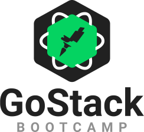
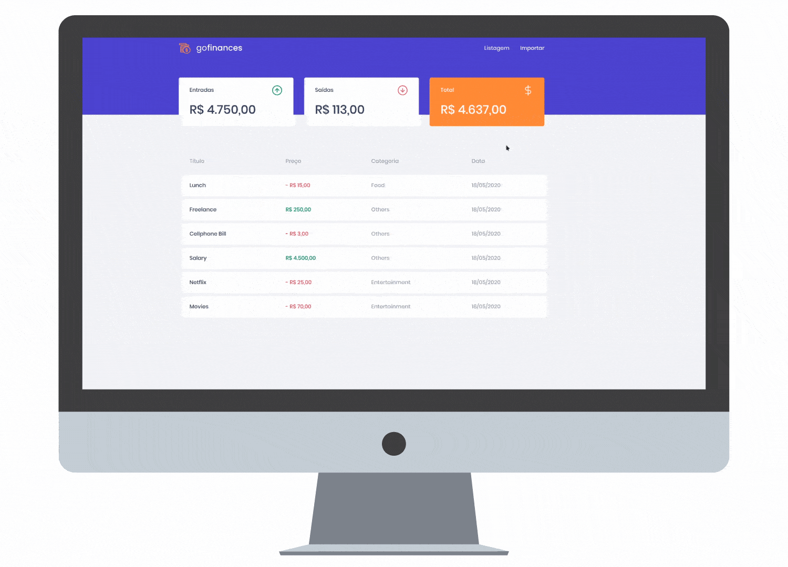

[linkedin-shield]: https://img.shields.io/badge/-LinkedIn-black.svg?style=flat-square&logo=linkedin&colorB=555
[linkedin-url]: https://www.linkedin.com/in/guerrero-roberto/
[![LinkedIn][linkedin-shield]][linkedin-url]
<p align="center">
    

  <h3 align="center">Project developed during 🚀<b>GoStack Bootcamp</b></h3>
</p>

## 📚 About



The goal of this project is to manage financial transactions imported from external sources, as a ```.csv``` sheet.

### User can:
- Navigate between the dashboard and import pages
- Import financial transactions in ```.csv``` files
- See the title, value, category and date of the imported trasactions
- See the total income, expenses and balance

Example ```.csv``` files can be found in the ```github``` folder.

## 🎈 Getting Started

You'll need [Docker](https://www.docker.com/) container configured with a [Posgres](https://www.postgresql.org/) image to run the server.

Clone the repo
```sh
git clone https://github.com/Betorresmo/GoMarketplace.git
```
Install yarn packages
```sh
yarn install
```

### Client

1. Running
```
yarn start
```

### Server

1. Start Docker container
```sh
docker start container-name :port
```
2. Start the server
```sh
yarn dev:server
```

## 💻 Technologies

- [TypeScript](https://github.com/microsoft/TypeScript)

### Client
- [React](https://reactjs.org/) 
- [Axios](https://github.com/axios/axios) 
- [Styled Components](https://styled-components.com/)

### Server
- [PostgreSQL](https://www.postgresql.org/)
- [Docker]()
- [TypeORM](https://typeorm.io/#/)
- [Express](https://expressjs.com/)
- [JestJS](https://jestjs.io/)


## 📬 [Contact me](https://www.linkedin.com/in/guerrero-roberto/)
